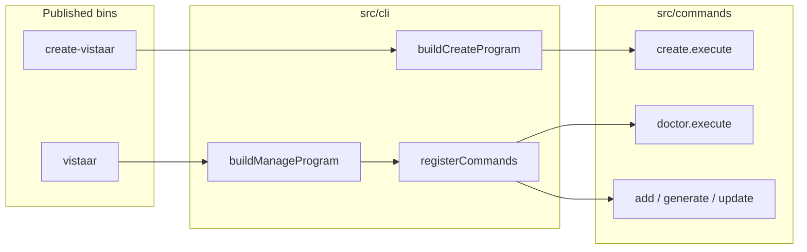
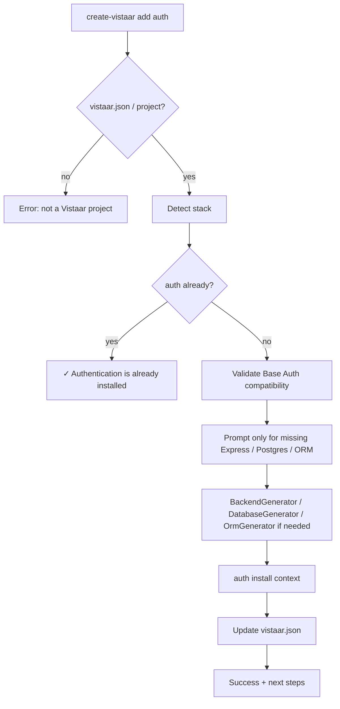
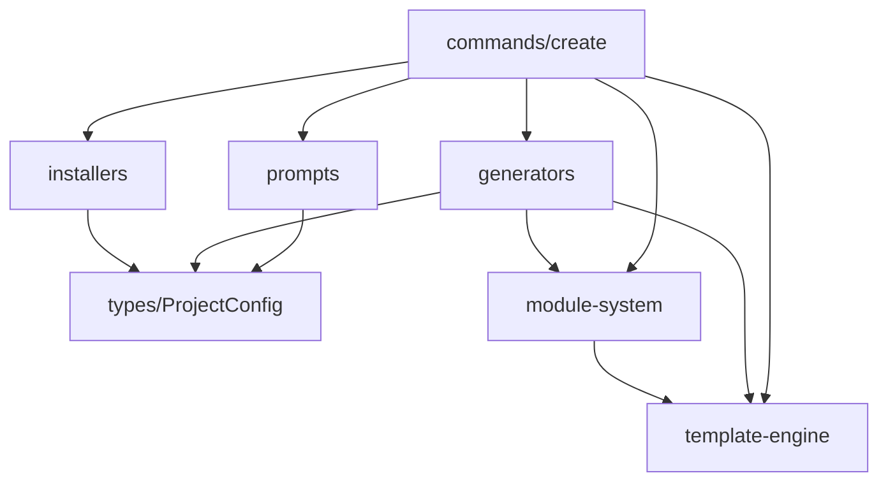

# 03 — Architecture

> Current architecture of the `create-vistaar` / `vistaar` CLIs. Code references are under `src/`.

## Overview

Vistaar is a **Node.js ESM TypeScript CLI** (`"type": "module"`, `module: NodeNext`). Runtime dependencies are small: Commander, Inquirer, fs-extra, execa, ora, chalk.



## Layering

| Layer | Path | Responsibility |
| --- | --- | --- |
| Entry | `src/index.ts`, `src/vistaar.ts` | Parse argv via Commander |
| CLI adapter | `src/cli/` | Register commands; **only** place that imports Commander |
| Commands | `src/commands/` | `execute(context)` — no Commander |
| Prompts / types | `src/prompts/`, `src/types/` | Collect and type `ProjectConfig` |
| Generators | `src/generators/` | Create files via templates |
| Template engine | `src/template-engine/` | Copy + `{{VAR}}` substitution |
| Module system | `src/module-system/` | Discover/resolve/install modules |
| Installers | `src/installers/` | Side-effectful post steps (env files, npm, git, db setup, …) |
| Utils | `src/utils/` | Logger, config printing |

**Design rule:** scaffolding and package-manager side effects stay separated (`ProjectGenerator` vs `ProjectInstaller`).

**Setup philosophy (Phase 15):** automate everything that is environment-independent (copy `.env`, install deps, generate local secrets, wire scripts). Clearly guide the developer through anything environment-specific (create the database, set `DATABASE_URL` / `MONGODB_URI`). Prefer the Setup Wizard over memorizing commands.

## CLI flow

1. Binary loads `buildCreateProgram()` or `buildManageProgram()`.
2. Commander invokes a `CliCommand.execute(CommandContext)`.
3. Context carries `cwd`, `args`, `options` (`src/commands/types.ts`).

Create path does **not** register management commands (and vice versa).

## Command system

```ts
interface CliCommand {
  name: string;
  description: string;
  category: "creation" | "management";
  execute(context: CommandContext): Promise<void>;
}
```

| Command | Status | Role |
| --- | --- | --- |
| `create` | Implemented | Full scaffold |
| `doctor` | Partial | Runs project `scripts/doctor.js` or `npm run doctor` |
| `add` / `generate` / `update` | Coming soon | `printComingSoon` |

## Template system (summary)

`TemplateEngine` resolves ids under `templates/`, validates directories, copies with fs-extra, then walks the destination replacing `{{KEY}}` in text files and filenames. Variables come from `createTemplateVariables(config)`.

Details: [06-template-system.md](./06-template-system.md).

## Module system (summary)

`ModuleRegistry` scans `modules/*/module.json`, resolves `enabledWhen` + `compatibleWith` + dependencies, and calls each module’s `install(context)`. Most modules call `context.helpers.standardInstall(context)`.

Details: [05-module-system.md](./05-module-system.md).

## Project generation lifecycle

```mermaid
sequenceDiagram
  participant User
  participant Create as create.execute
  participant Prompts as collectProjectConfig
  participant PG as ProjectGenerator
  participant MG as ModuleGenerator
  participant PI as ProjectInstaller
  participant Manifest as vistaar.json

  User->>Create: create-vistaar
  Create->>Prompts: interactive questions
  Prompts-->>Create: ProjectConfig
  Create->>PG: generate(config)
  Note over PG: frontend → ui → backend? → database? → orm?<br/>→ project-root → readme → modules
  PG->>MG: install matching modules
  MG-->>PG: appliedModules
  PG-->>Create: GenerationResult
  Create->>PI: install(generation)
  Create->>Manifest: write vistaar.json
  PI-->>User: success banner
```

### Add auth to an existing project (Phase 14)



Default generator order is documented in `ProjectGenerator` (`src/generators/project-generator.ts`):

## Zero-friction setup (Phase 15)

Installer order (default `ProjectInstaller`):

1. **EnvInstaller** — `.env.example` → `.env` (never overwrite); fill safe local secrets
2. **NpmInstaller** — including `auth-api/` when present
3. Git / ESLint / Husky
4. **DatabaseSetupInstaller** — main-backend migrate/seed when ORM; auth schema + Super Admin seed when Base Auth
5. Module post-install

Generated projects include a root `.gitignore` that ignores `.env`.

When Base Auth is selected, create (and `add auth`) prompts for the initial Super Admin (name + email; password is validated then discarded because login is email OTP). Pending admin is stored in `auth-api/.vistaar/initial-admin.json` and seeded via `npm run seed` after the database is reachable.

Default auth roles: `super-admin`, `admin`, `user` (stable slugs).

Normal flow does **not** require remembering `auth:init-db` / `auth:create-admin` — those remain as advanced escape hatches. Prefer `npm run migrate` + `npm run seed` and the Setup Wizard.

1. `FrontendGenerator`
2. `UIGenerator`
3. `BackendGenerator` (if backend ≠ none)
4. `DatabaseGenerator` (if database ≠ none)
5. `OrmGenerator` (Express + DB + ORM)
6. `RootExtrasGenerator`
7. `ReadmeGenerator`
8. `ModuleGenerator` (last — overlays)

**Docker** is installed via `modules/docker` when `config.docker === true`, not via the default generator list. `DockerGenerator` still exists for optional/manual use.

## Dependency flow



- Generators depend on `TemplateEngine` and types — not on installers.
- Modules receive `engine` + `variables` via `ModuleContext`.
- `src/modules/` is a **compatibility barrel** re-exporting `module-system` (prefer `module-system` for new code).

## Key invariants

1. Commands do not import Commander.
2. Generators do not run `npm install`.
3. Module selection is data-driven (`module.json`), not hardcoded `if (auth)` in the generator.
4. Installer failures should not erase a successful scaffold (graceful per-installer handling in `ProjectInstaller`).
5. Published artifacts include `dist/`, `templates/`, `modules/`, and docs markdown listed in `package.json` `files`.
