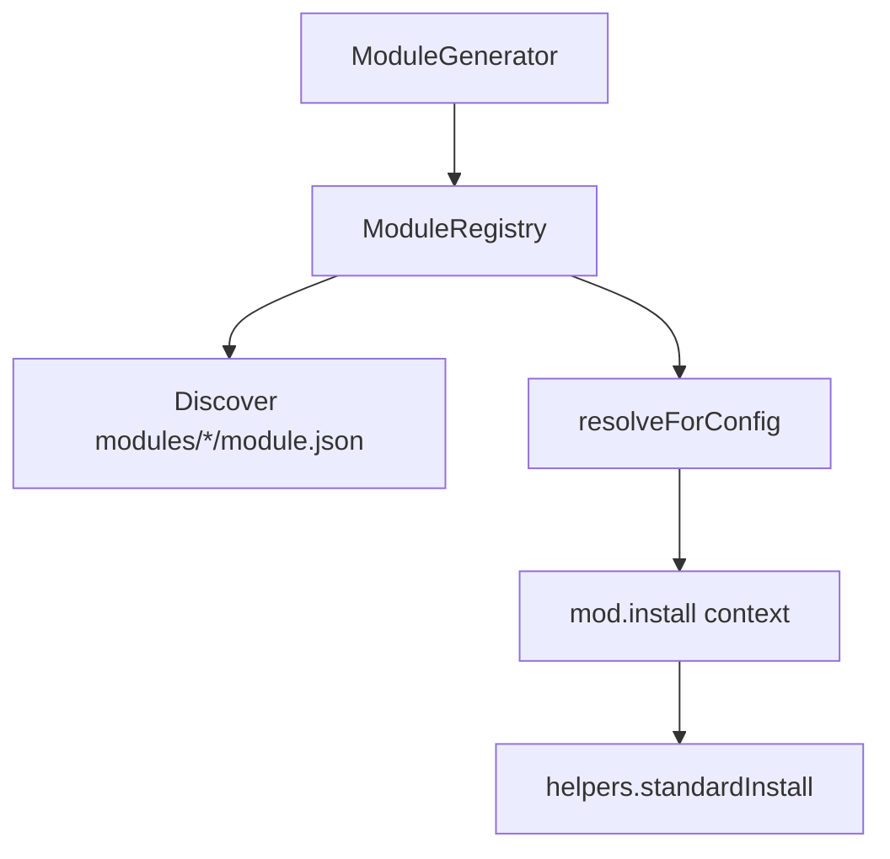

# 05 — Module System

> Documents the **current** local module system (`src/module-system/` + repo-root `modules/`). Marketplace / remote packages are future-only — see `MODULES.md`.

## Purpose

Optional features (auth, Docker, …) must overlay a generated project **without** the generator hardcoding each feature name. Modules are data-driven folders with a stable installer API so the same path can later power `vistaar add`.

## Architecture



| Piece | File(s) | Role |
| --- | --- | --- |
| Registry | `src/module-system/registry.ts` | Discover, load install fn, resolve plan, invoke install |
| Types | `src/module-system/types.ts` | `ModuleManifest`, `ModuleContext`, `RegisteredModule` |
| Standard install | `src/module-system/apply.ts` | Shared copy/merge/env/summary |
| Plan helpers | `resolveModulePlan`, `isModuleCompatible` | Variant + compatibility resolution |
| Generator bridge | `src/generators/module-generator.ts` | Calls `registry.resolveForConfig` during create |
| Public exports | `src/module-system/index.ts` | Prefer this over `src/modules/` |

Compatibility: `src/modules/index.ts` re-exports registry as `ModuleLoader` for older imports.

## Manifest (`module.json`)

Each discoverable module **must** have `module.json`. Important fields used today:

| Field | Purpose |
| --- | --- |
| `name` | Registry id |
| `displayName`, `version`, `description` | Metadata / logging |
| `dependencies` | Other local module names (topo-sorted) |
| `compatibleWith` | Backend ids this module supports |
| `enabledWhen` | `{ field, equals }` against `ProjectConfig` for auto-install |
| `templateFolders` | Map target → template subfolder |
| `npmPackages` | Merged into app `package.json` |
| `envExample` | Appended to `.env.example` |
| `variants` | Stack-specific overlays (language/backend) |
| `features` / `summaryTitle` | Printed after install |
| `postInstallCommands` | Run later by `ModulePostInstallInstaller` |

**Do not** hardcode module metadata inside the CLI — read the manifest.

## Installer (`install.js` / `install.ts`)

Contract:

```js
export async function install(context) {
  await context.helpers.standardInstall(context);
}
```

Registry load order (simplified): prefer `install.js` (runtime), typed `install.ts` for editors; if missing, fall back to `standardInstall`.

**Rule for module authors:** `install.js` must not hard-import deep CLI internals. Use `context` and `context.helpers.standardInstall`.

### `ModuleContext` (current shape)

Includes:

- `projectPath`, `paths` — write targets
- `config`, `stack` — selected options
- `variables` — template substitution map
- `engine` — `TemplateEngine`
- `moduleRoot`, `manifest`
- `helpers.standardInstall`

## Registry lifecycle

1. **Discover** — scan `modulesRoot` for directories containing `module.json`; skip hidden dirs and `shared/`.
2. **Load** — parse manifest; bind `install` function.
3. **Resolve** (`resolveForConfig`) — match `enabledWhen`, check `compatibleWith`, pull transitive `dependencies`, topological sort.
4. **Install** — call each `install(context)` in order.
5. **Post-install** (separate installer phase) — run `postInstallCommands` if any.

## `standardInstall` steps

Implemented in `src/module-system/apply.ts`:

1. Resolve variant plan from manifest + stack
2. Copy each template folder into frontend / backend / root via merge helpers (prefer `moduleRoot/templates/...`, fallback `moduleRoot/...`)
3. Merge npm packages into the relevant `package.json`
4. Append `.env.example` blocks
5. Print feature summary

## Catalog today

| Module | Auto-enabled when | Behavior |
| --- | --- | --- |
| `auth` | `authentication === "base-auth"` | Custom `install.js` copies **`modules/base-auth`** (source of truth) into `auth-api/` + `frontend/src/auth/`, injects one UI adapter |
| `docker` | `docker === true` | `standardInstall` — Compose/Dockerfiles under templates |
| `rbac` | — | Stub warn; does not install files |
| `aws-s3` | — | Stub |
| `email` | — | Stub |
| `swagger` | — | Stub |
| `redis` | — | Stub |
| `shared` | skipped | Not a module |
| `base-auth/` | not a module (no `module.json`) | Nested product tree consumed by `modules/auth` |

### Base Auth (Phase 13–14)

- Prompt: `Authentication: None | Base Auth` (Base Auth only when Express + PostgreSQL)
- `ProjectConfig.authentication`: `"none" | "base-auth"`
- UI: one VistaarUI adapter (`native` baseline / `bootstrap` / `shadcn` / `material-ui`) — no mixed CSS frameworks
- Backend: Express-only; FastAPI/Mongo never get Base Auth
- DB: PostgreSQL via auth-api `pg` (independent of Prisma/Drizzle on the main backend)
- **Add later:** `create-vistaar add auth` / `vistaar add auth` reads `vistaar.json`, installs missing Express/Postgres/ORM (or No ORM), then calls the same `install(context)`
- Base Auth does **not** require Prisma/Drizzle — `orm: null` + PostgreSQL is valid
- See `modules/auth/README.md`, `modules/auth/COMPATIBILITY.md`, `project-docs/12-base-auth.md`

## Future extensibility (planned, not built)

| Idea | Constraint |
| --- | --- |
| `vistaar add <name>` | Should call the **same** `install(context)` |
| npm packages `@vistaar/*` | Keep installer signature; change discovery root later |
| Marketplace | Out of scope per `MODULES.md` |

Do not invent new lifecycle hooks in docs that are not in code. Extend via manifest fields and `install.js` customs on top of `standardInstall`.
