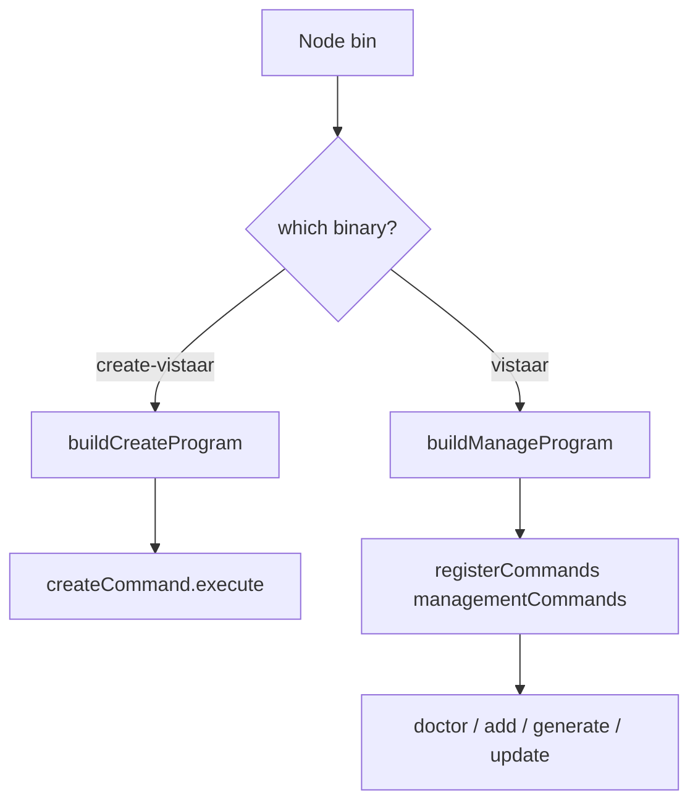
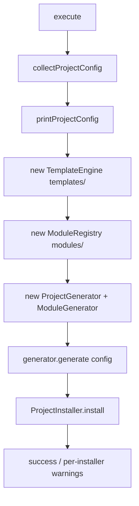

# 07 — CLI Flow

> Entry points, Commander registration, command execution, and the create lifecycle.

## Entry points

| Binary | Source | Builder |
| --- | --- | --- |
| `create-vistaar` | `src/index.ts` | `buildCreateProgram()` |
| `vistaar` | `src/vistaar.ts` | `buildManageProgram()` |

Both call `program.parseAsync(process.argv)`.



## Argument parsing

- Library: **Commander** (`commander` package).
- Create program (`src/cli/create-program.ts`):
  - Root `.action` → create
  - Optional `create` subcommand → same
  - `.version("0.1.0")` — note: may lag `package.json` (`0.2.0`)
- Manage program (`src/cli/manage-program.ts`):
  - Registers each management `CliCommand`
  - Same version string pattern

## Command registration

`src/cli/register.ts` is the **only** Commander-aware registration helper:

- Adds `.argument("[args...]")`
- On action: `command.execute(createContext({ cwd, args, options: {} }))`

Commands themselves export plain objects:

```ts
// conceptual
export const createCommand: CliCommand = {
  name: "create",
  description: "...",
  category: "creation",
  execute,
};
```

Index barrels (`src/commands/index.ts`):

- `creationCommands` = `[createCommand]`
- `managementCommands` = `[doctor, add, generate, update]`

## Execution flow — create

File: `src/commands/create/index.ts`

Authentication is a **conditional select** after ORM:

- Compatible (Express + PostgreSQL): `None` | `Base Auth`
- Otherwise: only `None` (message explains Base Auth needs Express + PostgreSQL)

When `authentication === "base-auth"`, `ModuleRegistry` selects `modules/auth`, whose `install.js` copies `modules/base-auth` and wires the app.



Package root is resolved relative to the compiled command file (`resolvePackageRoot`) so `templates/` and `modules/` resolve correctly from both `tsx` and `dist/`.

## Execution flow — doctor

File: `src/commands/doctor/index.ts`

1. If `<cwd>/scripts/doctor.js` exists → run with Node
2. Else if root `package.json` has `scripts.doctor` → `npm run doctor`
3. Else → coming-soon message

## Execution flow — add / generate / update

Always `printComingSoon` today (`src/commands/shared/coming-soon.ts`). No filesystem mutation.

## Error handling

| Layer | Behavior |
| --- | --- |
| Prompts | Inquirer validation / user cancel (Ctrl+C) aborts process |
| TemplateEngine | Throws typed errors (`TemplateNotFoundError`, destination errors) |
| ProjectGenerator | Asserts project root available before writing; generator failures abort scaffold |
| ProjectInstaller | **Fail-soft**: individual installer errors are caught/logged; scaffold remains |
| Coming-soon cmds | No-op aside from messaging |

There is no global CLI error boundary beyond Node’s unhandled rejection behavior. Logging goes through `src/utils/logger.ts` (chalk-colored console).

## Generation lifecycle (detail)

Inside `ProjectGenerator.generate`:

1. Compute `projectRoot = cwd/projectName`
2. Ensure directory is available
3. Build `paths`, `variables`, shared `GeneratorContext`
4. For each generator where `supports(config)`:
   - spinner (ora) + `generate(context)`
5. Return `GenerationResult` (`paths`, `config`, `completedGenerators`, `appliedModules`)

Then `ProjectInstaller` runs default installers in order:

`npm` → `git` → `eslint-prettier` → `husky` → `database-setup` → `module-postinstall`

## Design constraints for CLI changes

1. Do not import Commander inside `src/commands/**`.
2. Do not register management commands on the create binary (keeps scaffolding decoupled).
3. Prefer extending `execute(context)` so the same modules can ship in a future standalone package.
